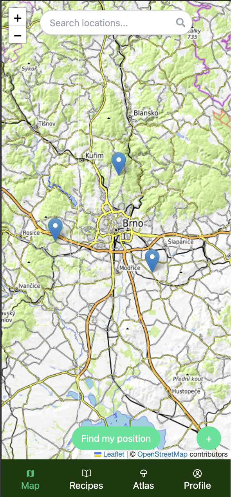
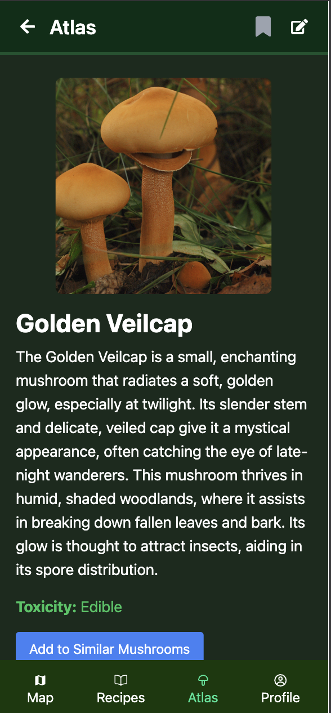
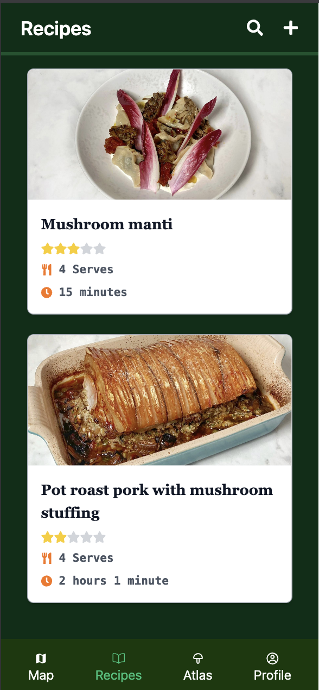

# NaHriby! 🍄

**NaHriby!** is an interactive web application for mushroom enthusiasts. Built using **React** and **Supabase**, the app allows users to explore mushroom locations on a map, view and edit mushroom entries, share recipes, and manage favorite content.

> 🧪 This project was created as part of the **User Interface Programming (ITU)** course at Brno University of Technology.

---

## 🚀 Features

- 📍 Interactive map with geolocated mushroom spots
- 🍄 Mushroom atlas with detailed species information
- 📷 Ability to add new mushroom sightings with photos
- 🧑‍🍳 Recipe sharing and browsing
- 💾 User accounts with saved entries and favorites
- 🔍 Similar mushroom grouping and comparison
- ✏️ Full CRUD operations (Create, Read, Update, Delete) for mushrooms, locations, comments, and recipes

---

## 🛠️ Tech Stack

- **React** (Vite)
- **Supabase** (PostgreSQL, Authentication, Storage)
- **React Router**
- **React Hot Toast** for notifications

---

## 📁 File Structure & Authors

### Root

- `App.jsx` - Main application layout and routing (Everyone)
- `main.jsx` - App entry point (Generated)
- `index.css` - Global styling, especially for the map (Marek Joukl)

### `/src/api`

Handles API communication with Supabase and other services:

- `apiMap.js` - Map and location logic (Marek Joukl)
- `apiMushrooms.js`, `apiSimilarMushrooms.js` - Mushroom handling (Ondrej Kozanyi)
- `apiRecipes.js` - Recipe handling (Igor Mikula)
- `apiUsers.js` - User data handling (Aurel Strigac)

### `/src/features`

Modular structure by feature:

- `map/` - Location-related screens and logic (Marek Joukl)
- `mushrooms/` - Mushroom atlas and forms (Ondrej Kozanyi)
- `recepies/` - Recipe browsing and creation (Igor Mikula)
- `user/` - User profile and saved content (Aurel Strigac)

### `/src/contexts`

- `UserContext.js` - Context for logged-in user data (Marek Joukl)

### `/src/ui`

- Shared components and styles used across the app (All authors)

---

## 📦 Getting Started

```bash
# Clone the repository
git clone https://github.com/YOUR_USERNAME/nahriby-mushroom-app.git
cd nahriby-mushroom-app

# Install dependencies
npm install --legacy-peer-deps

# Start development server
npm run dev
```

## 👥 Authors

• Marek Joukl (xjoukl00) - **Leader**

• Aurel Strigáč (xstrig00)

• Igor Mikula (xmikul74)

• Ondrej Kožányi (xkozan01)

## 📸 Screenshots

<div align="center">
  
  
  
</div>

## 📝 License

MIT License – feel free to fork and build upon it!
